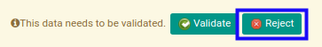
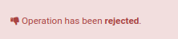

# Menolak Cash Receipt

## A. INPUT

* Cash receipt yang dapat ditolak harus memiliki status **Waiting for Approval**.

* User yang akan menolak harus memiliki akses untuk menolak cash receipt.

## B. LANGKAH KERJA

1. Buka menu **Accounting -> Bank & Cash -> Cash Receipt**. Abaikan jika sudah berada pada menu yang dimaksud.
2. Buka data cash receipt yang akan ditolak. Abaikan jika data sudah dibuka.
3. Klik tombol **Reject** pada bagian atas-kiri form.

## C. OUTPUT

* Data cash receipt telah ditolak.

