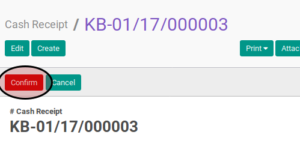
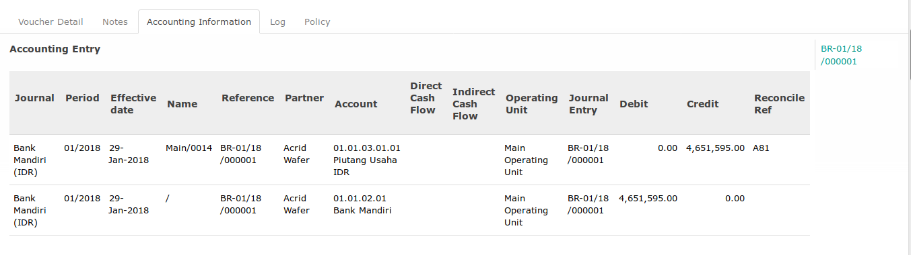

# Post Cash Receipt

## A. INPUT

* Data cash receipt yang akan di-*post* harus memiliki status **Ready To Process**, atau **Proforma**.

* User yang akan memposting harus memiliki akses untuk memposting cash receipt.

## B. LANGKAH KERJA

1. Buka menu **Accounting -> Bank & Cash -> Cash Receipt**. Abaikan jika sudah berada
pada menu yang dimaksud.
2. Buka data cash receipt yang akan di-*posting*. Abaikan jika data sudah dibuka.
3. Klik tombol **Post** pada bagian atas-kiri form. Pop-up form berjudul **Post Voucher**
akan muncul

4. Isi **Date** pada pop-up form **Post Voucher**
5. Klik tombol **Post** pada bagian bawah-kiri pop-up form **Post Voucher**

## C. OUTPUT

* Status dari cash receipt akan berubah menjadi **Posted**

* Penjurnalan cash receipt akan secara otomatis dibuat. Penjurnalan dapat dilihat pada tab **Accounting Information**. Isian **Accounting Entry** akan berisi journal entry yang dihasilkan. Sementara di bawah isian **Accounting Entry** akan memperlihatkan journal item dari penjurnalan cash receipt.

* Penjurnalan cash receipt akan mengikuti pedoman sebagai berikut:

    * Debit pada akun **Default Debit Account** yang dimiliki oleh **Journal** yang dipilih sejumlah **Total Voucher In Company Currency**
    * Untuk setiap voucher item, isian **Account** pada voucher item akan dikredit apabila isian **Amount In Company Currency At Voucher Date** bernilai positif. Apabila isian **Amount In Company Currency At Voucher Date** bernilai negatif pada isian **Account** pada voucher item akan didebit
