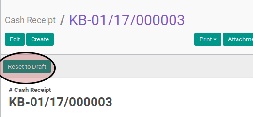

# Merestart Cash Receipt

## A. INPUT

* Data cash receipt yang akan direstart harus memiliki status **Cancelled**.

* User yang akan merestart harus memiliki akses untuk merestart cash receipt.

## B. LANGKAH KERJA

1. Buka menu **Accounting -> Bank & Cash -> Cash Receipt**. Abaikan jika sudah berada
pada menu yang dimaksud.
2. Buka data cash receipt yang akan di-*restart*. Abaikan jika data sudah dibuka.
3. Klik tombol **Reset to Draft** pada bagian atas-kiri form.

## C. OUTPUT

* Status dari cash receipt akan berubah menjadi **Draft**

* Isian cash receipt dapat diubah
