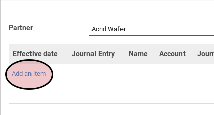

# Import Move Line

*(Instruksi kerja ini merupakan sub instruksi dari (1) [Membuat Cheque Payment](./membuat.md), atau (2) [Memodifikasi Cheque Payment](./memodifikasi.md). Instruksi kerja ini tidak bisa berdiri sendiri)*

## A. INPUT

*(Tidak ada instruksi khusus)*

## B. LANGKAH KERJA

1. Klik tombol **Import Move Line** pada tab **Voucher Detail**

Pop-up **Import Move Line** akan muncul.

2. Klik label **Add an Item**

3. Pilih *journal item*
4. Klik tombol **Import** pada bagian bawah-kiri pop-up

5. Lakukan sampai semua *journal item* yang mau direkonsiliasi sudah terimport.
6. Lanjutkan prosedur (1) [Langkah ke-15 pada Membuat Cheque Payment](./membuat.md#langkah-15), atau (2) [Langkah ke-16 pada Memodifikasi Cheque Payment](./memodifikasi.md#langkah-16)

## C. OUTPUT

*(Tidak ada instruksi khusus)

