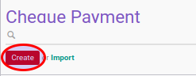

# Membuat Cheque Payment

## A. INPUT

*(Tidak ada instruksi khusus)*

## B. LANGKAH KERJA

1. Buka menu **Accounting -> Bank & Cash -> Cheque Payment**
2. Klik tombol **Create** pada bagian atas-kiri form.

3. Ubah **[# Cheque](./penjelasan.md#field-name)** sesuai dengan nomor cek. Wajib diisi.
4. Ubah **[Company](./penjelasan.md#field-company)** jika dibutuhkan. Hanya terlihat pada implementasi multi-company. Harus diisi.
5. Isi **[Date](./penjelasan.md#field-date)**. Harus diisi.
6. Isi **[Date Issue](./penjelasan.md#field-date-issue)**. Harus diisi.
7. Biarkan isian **[Period](./penjelasan.md#field-period)**.
8. Pilih **[Journal](./penjelasan.md#field-journal)**. Harus diisi.
9. Pilih **[Partner](./penjelasan.md#field-partner)** Harus diisi.
10. Isi **[Payee](./penjelasan.md#field-payee)**. Harus diisi.
11. Pilih **[Source Bank Account](./penjelasan.md#field-source-account)**. Harus diisi.
12. Isi **[Total Voucher](./penjelasan.md#field-total-voucher)**. Harus diisi.
13. Isi **[Exchange Rate](./penjelasan.md#field-exchange-rate)**. Harus diisi.
14. <a name="l14">[Import](./membuat-detail-import.md)/[Tambah](./membuat-detail-manual.md)/[Modifikasi](./line-modifikasi.md)/[Hapus](./line-hapus.md) **Voucher Lines**</a>. Ulangi langkah ini sampai **Voucher Lines** sesuai dengan keinginan.
15. <a name="langkah-15">Isi</a> **[Write-Off Account](./penjelasan.md#field-writeoff-account)** apabila nilai **[Amount Diff](./penjelasan.md#field-amount-diff)** tidak sama dengan 0.0 dan nominal tersebut ingin di-*write-off* ke akun tertentu.
16. Klik tombol **Save** pada bagian atas-kiri form.

## C. OUTPUT

*(Tidak ada instruksi khusus)*
