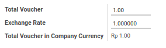
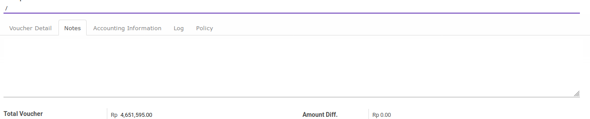

# Penjelasan

Informasi pada Cheque Payment dibagi menjadi beberapa area, diantaranya:

* [Header](#bagian-header)
* [Voucher Item](#bagian-detail)
* [Footer](#bagian-footer)
* [Tab Notes](#tab-notes)
* [Tab Accounting Information](#tab-accounting-information)
* [Tab Log](#tab-log)
* [Tab Policy](#tab-policy)

### <a name="bagian-header">HEADER</a>

#### <a name="field-name"># Cheque</a>

Nomor cek yang diterima

#### <a name="field-company">Company</a>

Perusahaan pemilik dokumen cek

#### <a name="field-ou">Default Operating Unit</a>

Operating unit pemilik dokumen. Secara default terisi sesuai dengan operating unit pada Journal.

#### <a name="field-date">Date</a>

Tanggal diterimanya cek

#### <a name="field-date-issue">Date Issued</a>

Tanggal dikeluarkannya cek

#### <a name="field-period">Period</a>

Periode akuntansi diterimanya cek

#### <a name="field-journal">Journal</a>

Buku jurnal yang akan digunakan untuk mencatat penjurnalan pembayaran cek.

#### <a name="field-partner">Partner</a>

Pihak yang mengeluarkan cek. Field ini akan menentukan *partner* yang digunakan pada penjurnalan pembayaran 
cek. *Partner* yang digunakan pada penjurnalan pembayaran cek adalah *commercial partner*
dari isian **Partner**. Diisi apabila pembayaran terkait hanya dengan 1 pihak pemberi. Jangan diisi
apabila pembayaran terkait dengan lebih dari 1 pihak pemberi.

#### <a name="field-payee">Payee</a>

Pihak penerima pembayaran

#### <a name="field-source-account">Source Bank Account</a>

Rekening bank yang mengeluarkan cek

#### <a name="field-description">Description</a>

Keterangan utama transaksi. Isi field ini akan digunakan sebagai deskripsi penjurnalan cheque payment di
sisi debit. Akan muncul di *general ledger*

### <a name="bagian-footer">FOOTER</a>

#### <a name="field-total-voucher">Total Voucher</a>

Total pembayaran dalam mata uang yang sesuai dengan buku jurnal

#### <a name="field-exchange-rate">Exchange Rate</a>

Spot rate kurs

#### <a name="field-total-voucher-company-currency">Total Voucher In Company Currency</a>

Total pembayaran dalam mata uang perusahaan. Nilai ini akan didebit pada penjurnalan pembayaran cek.

### <a name="bagian-detail">DETAIL</a>

#### <a name="field-detail-partner">Partner</a>

Pihak penerima. Apabila cheque payment terkait hanya dengan satu pihak penerima, maka isian
ini harus sama dengan isian **Partner** pada bagian header.

#### <a name="field-detail-move-line">Move Line</a>

Journal item yang akan direkonsiliasi

#### <a name="field-detail-account">Account</a>

Akun yang akan dikredit pada penjurnalan cheque payment

#### <a name="field-detail-aa">Analytic Account</a>

Kode biaya

#### <a name="field-detail-amount">Amount</a>

Jumlah detail pembayaran.

#### <a name="field-detail-amount-move-date">Amount In Company Currency At Move Date</a>

Jumlah detail pembayaran sesuai dengan mata uang perusahaan dengan kurs tanggal **Move Line**

#### <a name="field-detail-amount-voucher-date">Amount In Company Currency At Voucher Date</a>

Jumlah detail pembayaran sesuai dengan mata uang perusahaan dengan kurs sesuai dengan spot rate. Nilai ini akan dikredit pada penjurnalan cheque payment jika bernilai positif. Nilai ini akan didebit jika bernilai negatif.

#### <a name="field-detail-diff">Diff Amount In Company Currency</a>

Selisih antara **Amount In Company Currency At Move Date** dan **Amount In Company Currency At Voucher Date**. Nilai ini akan dijurnal sebagai selisih kurs jika > 0.0

#### <a name="field-detail-description">Description</a>

Keterangan **Voucher Detail**.

### <a name="tab-notes">TAB NOTES</a>

#### <a name="field-note">Note</a>

Catatan tambahan

### <a name="tab-accounting-information">TAB ACCOUNTING INFORMATION</a>

#### <a name="field-accounting-entry">Accounting Entry</a>

Penjurnalan (journal entry) yang dihasilkan ketika cheque payment diposting

### <a name="tab-log">TAB LOG</a>

### <a name="tab-log">TAB POLICY</a>

