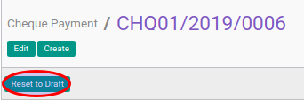

# Merestart Cheque Payment

## A. INPUT

* Data cheque payment yang akan direstart harus memiliki status **Cancel**.

* User yang akan merestart harus memiliki akses untuk merestart cheque payment.

## B. LANGKAH KERJA

1. Buka menu **Accounting -> Bank & Cash -> Cheque Payment**. Abaikan jika sudah berada
pada menu yang dimaksud.
2. Buka data cheque payment yang akan di-*restart*. Abaikan jika data sudah dibuka.
3. Klik tombol **Reset to Draft** pada bagian atas-kiri form.

## C. OUTPUT

* Status dari cheque payment akan berubah menjadi **Draft**

* Isian cheque payment dapat diubah
