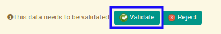

# Menyetujui Cheque Receipt

## A. INPUT

* Data cheque receipt yang akan disetujui harus memiliki status **Waiting for Approval**.

* User yang akan menyetujui harus memiliki akses untuk menyetujui cheque receipt.

## B. LANGKAH KERJA

1. Buka menu **Accounting -> Bank & Cash -> Cheque Receipt**. Abaikan jika sudah berada pada menu yang dimaksud.
2. Buka data cheque receipt yang akan disetujui. Abaikan jika data sudah dibuka.
3. Klik tombol **Validate** pada bagian atas-kiri form.

## C. OUTPUT

* Status dari cheque receipt akan berubah menjadi **Ready to Process**.

