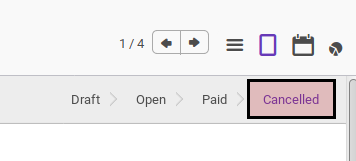

# Membatalkan Credit Note

## A. INPUT

* Data *credit note* yang akan divalidasi harus memiliki status **Draft**. *Credit note* dengan status **Open** juga dapat dibatalkan selama *credit note* belum memiliki pembayaran.

* User yang akan membatalkan harus memiliki akses untuk membatalkan *credit note*.

## B. LANGKAH KERJA

1. Buka menu **Accounting -> Customer -> Credit Note**. Abaikan jika sudah berada
pada menu yang dimaksud.
2. Buka data *credit note* yang akan dibatalkan. Abaikan jika data sudah dibuka.
3. Klik tombol **Cancel Invoice** pada bagian atas-kiri form.

## C. OUTPUT

* Status dari *credit note* akan berubah menjadi **Cancelled**

