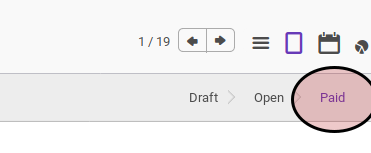

# Membayar Via Tunai atau Bank

## A. INPUT

* Data *credit note* yang akan diterima pembayarannya harus memiliki status **Open**.

## B. LANGKAH KERJA

*Credit note* dapat dibayarkan dengan menggunakan salah satu fitur berikut:

* [Bank Payment](../bank-payment.md)
* [Cash Payment](../cash-payment.md)
* [Giro Payment](../giro-payment.md)
* [Cheque Payment](../cheque-payment.md)

Lakukan prosedur yang sesuai dengan pembayaran yang terjadi.

## C. OUTPUT

* Nilai **[Balance](./penjelasan.md#field-balance)** akan bertambah sejumlah pembayaran yang dilakukan.
* Status dari *credit note* akan berubah menjadi **Paid**. Apabila nilai **[Balance](./penjelasan.md#field-balance)** sama dengan nilai **[Total](./penjelasan.md#field-total)**

