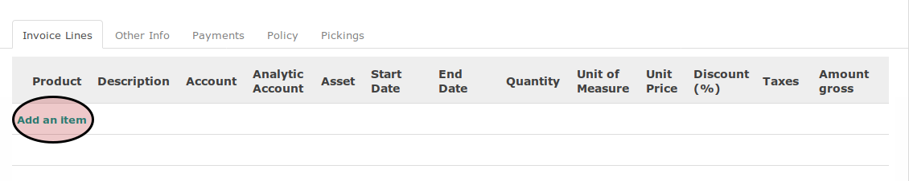

# Menambahkan Invoice Line

1. Klik label **Add an Item** pada tabel *invoice lines*

2. Isi **[Product](./penjelasan.md#field-product)**. Wajib Diisi.
3. Sesuaikan **[Description](./penjelasan.md#field-description)** jika dibutuhkan. Wajib Diisi.
4. Sesuaikan **[Account](./penjelasan.md#field-account-line)** jika dibutuhkan. Wajib Diisi.
5. Pilih **[Analytic Account](./penjelasan.md#field-aa)**. Tidak wajib diisi.
6. Abaikan **[Asset](./penjelasan.md#field-asset)**
7. Isi **[Start Date](./penjelasan.md#field-start-date)**. Tidak wajib diisi.
8. Isi **[End Date](./penjelasan.md#field-end-date)** Tidak wajib diisi.
9. Isi **[Quantity](./penjelasan.md#field-qty)**. Wajib Diisi. Tidak wajib diisi.
10. Pilih **[Unit of Measure](./penjelasan.md#field-uom)**. Tidak wajib diisi.
11. Isi **[Discount](./penjelasan.md#field-discount)**. Tidak wajib diisi.
12. Pilih **[Taxes](./penjelasan.md#field-taxes)** Tidak wajib diisi.
