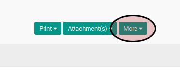

# Menghapus Credit Note

## A. INPUT

* Data *credit note* yang akan dihapus harus memiliki status **Draft**.

## B. LANGKAH KERJA

1. Buka menu **Accounting -> Customer -> Credit Note**. Abaikan jika sudah berada
pada menu yang dimaksud.
2. Buka data *credit note* yang akan dihapus. Abaikan jika data sudah dibuka.
3. Klik tombol **Edit** pada bagian atas-kiri form. Abaikan dan lanjutkan ke langkah 5 jika isian **Force Number** tidak ada isinya.

4. Kosongkan isian **Force Number**
5. Klik tombol **More** pada bagian atas-tengah form.

6. Klik tombol **Delete** pada *drop-down* yang muncul ketika tombol **More** diklik.

7. Klik tombol **Ok** pada *pop-up* konfirmasi penghapusan yang muncul

## C. OUTPUT

* Data credit note akan terhapus.
