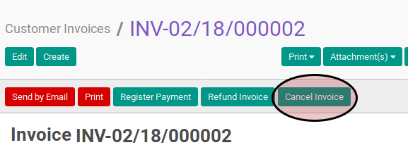

# Membatalkan Customer Invoice

## A. INPUT

* Data *customer invoice* yang akan divalidasi harus memiliki status **Draft**. *Customer invoice* dengan status **Open** juga dapat dibatalkan selama *customer invoice* belum memiliki pembayaran.

* User yang akan membatalkan harus memiliki akses untuk membatalkan *customer invoice*.

## B. LANGKAH KERJA

1. Buka menu **Accounting -> Customer -> Customer Invoice**. Abaikan jika sudah berada
pada menu yang dimaksud.
2. Buka data *customer invoice* yang akan dibatalkan. Abaikan jika data sudah dibuka.
3. Klik tombol **Cancel Invoice** pada bagian atas-kiri form.

## C. OUTPUT

* Status dari *customer invoice* akan berubah menjadi **Cancelled**

