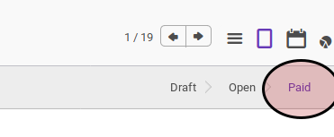

# Menerima Pembayaran Customer Invoice

## A. INPUT

* Data *customer invoice* yang akan diterima pembayarannya harus memiliki status **Open**.

## B. LANGKAH KERJA

*Customer invoice* dapat diterima pembayarannya dengan menggunakan salah satu fitur berikut:

* [Bank Receipt](../bank-receipt.md)
* [Cash Receipt](../cash-receipt.md)
* [Giro Receipt](../giro-receipt.md)
* [Cheque Receipt](../cheque-receipt.md)

Lakukan prosedur yang sesuai dengan penerimaan pembayaran yang terjadi.

## C. OUTPUT

* Nilai **[Balance](./penjelasan.md#field-balance)** akan bertambah sejumlah penerimaan pembayaran yang dilakukan.
* Status dari *customer invoice* akan berubah menjadi **Paid**. Apabila nilai **[Balance](./penjelasan.md#field-balance)** sama dengan nilai **[Total](./penjelasan.md#field-total)**

