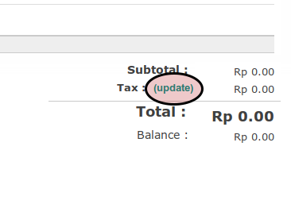

# Membuat Customer Invoice

## A. INPUT

*(Tidak ada instruksi khusus)*

## B. LANGKAH KERJA

1. Buka menu **Accounting -> Customer -> Customer Invoice**. Abaikan jika sudah berada pada menu yang dimaksud.
2. Klik tombol **Create** pada bagian atas-kiri form.

3. Isi **[Customer](./penjelasan.md#field-customer)**. Wajib diisi.
4. Abaikan **[Fiscal Position](./penjelasan.md#field-fiscal-position)**.
5. Isi **[Invoice Date](./penjelasan.md#field-invoice-date)**. Wajib diisi.
6. Isi **[Force Number](./penjelasan.md#field-force-number)**. Tidak wajib diisi.
7. Pilih **[Operating Unit](./penjelasan.md#field-ou)**. Tidak wajib diisi.
8. Pilih **[Journal](./penjelasan.md#field-journal)**. Wajib diisi.
9. Pilih **[Account](./penjelasan.md#field-account)**. Wajib diisi.
10. Pilih **[Sale Type](./penjelasan.md#field-sale-type)**. Wajib diisi.
11. Pilih **[Currency](./penjelasan.md#field-currency)**. Wajib diisi.
12. Beralih ke tab **[Other Info](./penjelasan.md#penjelasan-tab-other-info)**.
13. Pilih **[Salesperson](./penjelasan.md#field-salesperson)**. Tidak wajib diisi.
14. Pilih **[Sales Team](./penjelasan.md#field-sales-team)**. Tidak wajib diisi.
15. Pilih **[Bank Account](./penjelasan.md#field-bank-account)**. Tidak wajib diisi.
16. Abaikan **[Accounting Period](./penjelasan.md#field-accounting-period)**.
17. Isi **[Due Date](./penjelasan.md#field-due-date)**. Wajib diisi.
18. Isi **[Source Document](./penjelasan.md#field-source-document)**. Tidak wajib diisi.
19. Isi **[Reference/Description](./penjelasan.md#field-reference)**. Tidak wajib diisi.
20. <a name="l20">[Tambah](./membuat-manual-invoice-line.md)/[Modifikasi](./memodifikasi-manual-invoice-line.md)/[Hapus](./menghapus-manual-invoice-line.md) Invoice Line</a>. Ulangi langkah ini sampai **Invoice Lines** sesuai dengan keinginan.
21. Beralih ke tab **[Invoice Lines](./penjelasan.md#penjelasan-tab-invoice-line)**.
22. Pilih **[Payment Term](./penjelasan.md#field-payment)**. Tidak wajib diisi.
23. Isi **[Additional Information](./penjelasan.md#field-additional-information)** Tidak wajib diisi.
24. Klik label **Update** pada bagian bawah-kanan

25. Klik tombol **Save** pada bagian atas-kiri form.

## C. OUTPUT

*(Tidak ada instruksi kerja)*
