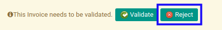

# Menolak Customer Invoice

## A. INPUT

* Customer Invoice yang dapat ditolak harus memiliki status **Waiting for Approval**.

* User yang akan menolak harus memiliki akses untuk menolak customer invoice.

## B. LANGKAH KERJA

1. Buka menu **Accounting -> Customer -> Customer Invoice**. Abaikan jika sudah berada pada menu yang dimaksud.
2. Buka data customer invoice yang akan ditolak. Abaikan jika data sudah dibuka.
3. Klik tombol **Reject** pada bagian atas-kiri form.

## C. OUTPUT

* Data customer invoice telah ditolak.

