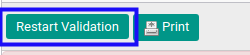

# Merestart Persetujuan Customer Invoice

## A. INPUT

* Customer Invoice yang dapat direstart persetujuan harus memiliki status **Waiting for Approval**.

* Customer Invoice yang dapat direstart persetujuan harus memiliki kondisi **Operation has been rejected**.

* User yang akan merestart persetujuan harus memiliki akses untuk merestart persetujuan customer invoice.

## B. LANGKAH KERJA

1. Buka menu **Accounting -> Customer -> Customer Invoice**. Abaikan jika sudah berada pada menu yang dimaksud.
2. Buka data customer invoice yang akan direstart persetujuan. Abaikan jika data sudah dibuka.
3. Klik tombol **Restart Validation** pada bagian atas-kiri form.

## C. OUTPUT

* Data customer invoice telah dapat dilakukan persetujuan.

