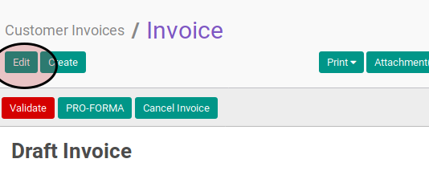

# Memodifikasi Customer Invoice

## A. INPUT

* Data customer invoice yang dapat dimodifikasi harus memiliki status **Draft**.

## B. LANGKAH KERJA

1. Buka menu **Accounting -> Customer -> Customer Invoice**. Abaikan jika sudah berada pada menu yang dimaksud.
2. Buka data customer invoice yang akan dimodifikasi. Abaikan jika data sudah dibuka.
3. Klik tombol **Edit** pada bagian atas-kiri form.

4. Isi dan sesuaikan **[Customer](./penjelasan.md#field-customer)** jika dibutuhkan. Wajib diisi.
5. Abaikan **[Fiscal Position](./penjelasan.md#field-fiscal-position)**.
6. Isi dan sesuaikan **[Invoice Date](./penjelasan.md#field-invoice-date)** jika dibutuhkan. Wajib diisi.
7. Isi dan sesuaikan **[Force Number](./penjelasan.md#field-force-number)** jika dibutuhkan. Tidak wajib diisi.
8. Pilih dan sesuaikan **[Operating Unit](./penjelasan.md#field-ou)** jika dibutuhkan. Tidak wajib diisi.
9. Pilih dan sesuaikan **[Journal](./penjelasan.md#field-journal)** jika dibutuhkan. Wajib diisi.
10. Pilih dan sesuaikan **[Account](./penjelasan.md#field-account)** jika dibutuhkan. Wajib diisi.
11. Pilih dan sesuaikan **[Sale Type](./penjelasan.md#field-sale-type)** jika dibutuhkan. Wajib diisi.
12. Pilih dan sesuaikan **[Currency](./penjelasan.md#field-currency)** jika dibutuhkan. Wajib diisi.
13. Beralih ke tab **[Other Info](./penjelasan.md#penjelasan-tab-other-info)**.
14. Pilih dan sesuaikan **[Salesperson](./penjelasan.md#field-salesperson)** jika dibutuhkan. Tidak wajib diisi.
15. Pilih dan sesuaikan **[Sales Team](./penjelasan.md#field-sales-team)** jika dibutuhkan. Tidak wajib diisi.
16. Pilih dan sesuaikan **[Bank Account](./penjelasan.md#field-bank-account)** jika dibutuhkan. Tidak wajib diisi.
17. Abaikan **[Accounting Period](./penjelasan.md#field-accounting-period)**.
18. Isi dan sesuaikan **[Due Date](./penjelasan.md#field-due-date)** jika dibutuhkan. Wajib diisi.
19. Isi dan sesuaikan **[Source Document](./penjelasan.md#field-source-document)** jika dibutuhkan. Tidak wajib diisi.
20. Isi dan sesuaikan **[Reference/Description](./penjelasan.md#field-reference)** jika dibutuhkan. Tidak wajib diisi.
21. <a name="l21"> [Tambah](./membuat-manual-invoice-line.md)/[Modifikasi](./memodifikasi-manual-invoice-line.md)/[Hapus](./menghapus-manual-invoice-line.md) Invoice Line</a>. Ulangi langkah ini sampai **Invoice Lines** sesuai dengan keinginan.
22. Beralih ke tab **[Invoice Lines](./penjelasan.md#penjelasan-tab-invoice-line)**.
23. Pilih dan sesuaikan **[Payment Term](./penjelasan.md#field-payment)** jika dibutuhkan. Tidak wajib diisi.
24. Isi dan sesuaikan **[Additional Information](./penjelasan.md#field-additional-information)** jika dibutuhkan. Tidak wajib diisi.
25. Klik label **Update** pada bagian bawah-kanan

26. Klik tombol **Save** pada bagian atas-kiri form.

## C. OUTPUT

* Data customer invoice akan berubah sesuai dengan perubahan yang dilakukan.
