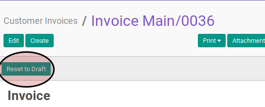

# Merestart Customer Invoice

## A. INPUT

* Data *customer invoice* yang akan divalidasi harus memiliki status **Cancelled**.

* User yang akan merestart harus memiliki akses untuk merestart *customer invoice*.

## B. LANGKAH KERJA

1. Buka menu **Accounting -> Customer -> Customer Invoice**. Abaikan jika sudah berada
pada menu yang dimaksud.
2. Buka data *customer invoice* yang akan direstart. Abaikan jika data sudah dibuka.
3. Klik tombol **Reset to Draft** pada bagian atas-kiri form.

## C. OUTPUT

* Status dari *customer invoice* akan berubah menjadi **Draft**

