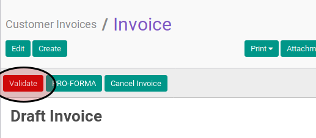

# Memvalidasi Customer Invoice

## A. INPUT

* Data *customer invoice* yang akan divalidasi harus memiliki status **Draft**.

* User yang akan memvalidasi harus memiliki akses untuk memvalidasi *customer invoice*.

## B. LANGKAH KERJA

1. Buka menu **Accounting -> Customer -> Customer Invoice**. Abaikan jika sudah berada
pada menu yang dimaksud.
2. Buka data *customer invoice* yang akan disetujui. Abaikan jika data sudah dibuka.
3. Klik tombol **Validate** pada bagian atas-kiri form.

## C. OUTPUT

* Status dari *customer invoice* akan berubah menjadi **Open**

