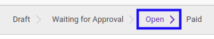

# Membatalkan Debit Note

## A. INPUT

* Data *debit note* yang akan divalidasi harus memiliki status **Draft**. *Debit note* dengan status **Open** juga dapat dibatalkan selama *debit note* belum memiliki penerimaan pembayaran.

* User yang akan membatalkan harus memiliki akses untuk membatalkan *debit note*.

## B. LANGKAH KERJA

1. Buka menu **Accounting -> Supplier -> Debit Note**. Abaikan jika sudah berada
pada menu yang dimaksud.
2. Buka data *debit note* yang akan dibatalkan. Abaikan jika data sudah dibuka.
3. Klik tombol **Cancel Invoice** pada bagian atas-kiri form.

## C. OUTPUT

* Status dari *debit note* akan berubah menjadi **Cancelled**

