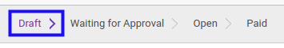

# Mengkonfirmasi Debit Note

## A. INPUT

* Data *debit note* yang akan dikonfirmasi harus memiliki status **Draft**.

* User yang akan mengkonfirmasi harus memiliki akses untuk mengkonfirmasi *debit note*.

## B. LANGKAH KERJA

1. Buka menu **Accounting -> Supplier -> Debit Note**. Abaikan jika sudah berada pada menu yang dimaksud.
2. Buka data *debit note* yang akan dikonfirmasi. Abaikan jika data sudah dibuka.
3. Klik tombol **Confirm** pada bagian atas-kiri form.

## C. OUTPUT

* Status dari *debit note* akan berubah menjadi **Waiting for Approval**

* Isian *debit note* sudah tidak bisa diubah.
