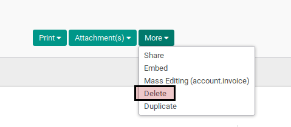

# Menghapus Debit Note

## A. INPUT

* Data *debit note* yang akan dihapus harus memiliki status **Draft**.

## B. LANGKAH KERJA

1. Buka menu **Accounting -> Supplier -> Supplier Refunds**. Abaikan jika sudah berada
pada menu yang dimaksud.
2. Buka data *debit note* yang akan dihapus. Abaikan jika data sudah dibuka.
3. Klik tombol **More** pada bagian atas-tengah form.

4. Klik tombol **Delete** pada *drop-down* yang muncul ketika tombol **More** diklik.

5. Klik tombol **Ok** pada *pop-up* konfirmasi penghapusan yang muncul

## C. OUTPUT

* Data debit note akan terhapus.
