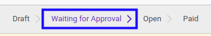

# Menolak Debit Note

## A. INPUT

* Debit Note yang dapat ditolak harus memiliki status **Waiting for Approval**.

* User yang akan menolak harus memiliki akses untuk menolak debit note.

## B. LANGKAH KERJA

1. Buka menu **Accounting -> Supplier -> Debit Note**. Abaikan jika sudah berada pada menu yang dimaksud.
2. Buka data debit note yang akan ditolak. Abaikan jika data sudah dibuka.
3. Klik tombol **Reject** pada bagian atas-kiri form.

## C. OUTPUT

* Data debit note telah ditolak.

