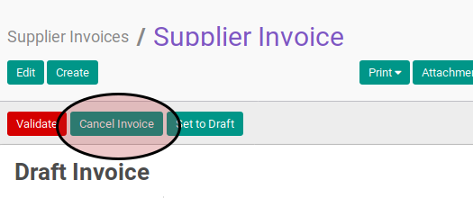

# Merestart Debit Note

## A. INPUT

* Data *debit note* yang akan divalidasi harus memiliki status **Cancelled**.

* User yang akan merestart harus memiliki akses untuk merestart *debit note*.

## B. LANGKAH KERJA

1. Buka menu **Accounting -> Supplier -> Debit Note**. Abaikan jika sudah berada
pada menu yang dimaksud.
2. Buka data *debit note* yang akan direstart. Abaikan jika data sudah dibuka.
3. Klik tombol **Reset to Draft** pada bagian atas-kiri form.

## C. OUTPUT

* Status dari *debit note* akan berubah menjadi **Draft**

