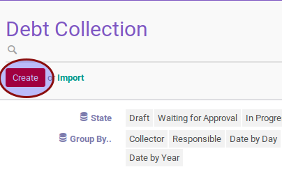

# Membuat Debt Collection

## A. INPUT

*(Tidak ada instruksi khusus)*

## B. LANGKAH KERJA

1. Buka menu **Accounting -> Customer -> Debt Collection**
2. Klik tombol **Create** pada bagian atas-kiri form.

3. Ubah **[# Debt Collection](./penjelasan.md#field-name)** dengan penomeran yang dikehendaki. Biarkan berisi **/**
apabila menghendaki penomeran otomatis.
4. Pilih **Type**. Wajib diisi.
5. Pilih **Collector**. Wajib diisi.
6. Pilih **Date**. Wajib diisi.
7. Pilih **Responsible**. Wajib diisi.
8. Import Invoice atau hapus invoice sampai tabel **Invoice Detail** sesuai dengan keinginan.
9. Klik tombol **Save** pada bagian atas-kiri form.

## C. OUTPUT
