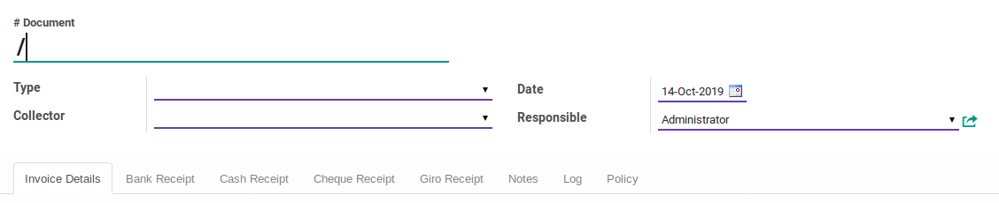

# Penjelasan

Informasi pada Debt Collection dibagi menjadi beberapa area, diantaranya:

* [Header](#bagian-header)
* [Tab Invoice Details](#tab-invoice-details)
* [Tab Bank Receipt](#tab-bank-receipt)
* [Tab Cash Receipt](#tab-cash-receipt)
* [Tab Cheque Receipt](#tab-cheque-receipt)
* [Tab Giro Receipt](#tab-giro-receipt)
* [Tab Notes](#tab-notes)
* [Tab Log](#tab-log)
* [Tab Policy](#tab-policy)

### <a name="bagian-header">HEADER</a>

#### # Document

Nomor dokumen debt collection.

#### Type

Tipe debt collection.

#### Collector

User yang bertanggung jawab untuk menagih.

#### Date

Tanggal penagihan.

#### Responsible

User yang bertanggung jawab untuk monitoring pelaksanaan penagihan.

### <a name="tab-invoice-details">TAB INVOICE DETAILS</a>

#### Invoice

#### Invoice Date

#### Invoice Due

#### Invoice Amount

#### Amount Due

#### Collected Amount

#### Collected Giro Amount

#### Collected Cheque Amount

#### Collected Bank Amount

#### Collected Cash Amount
