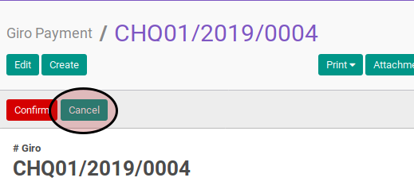

# Membatalkan Giro Payment

## A. INPUT

* Data giro payment yang akan dibatalkan dapat memiliki status **Draft**, atau **Waiting for Approval**, atau **Ready To Process**, atau **Proforma**, atau **Posted**
* User yang akan membatalkan harus memiliki akses untuk membatalkan giro payment.

## B. LANGKAH KERJA

1. Buka menu **Accounting -> Bank & Cash -> Giro Payment**. Abaikan jika sudah berada
pada menu yang dimaksud.
2. Buka data giro payment yang akan dibatalkan. Abaikan jika data sudah dibuka.
3. Klik tombol **Cancel** pada bagian atas-kiri form.

## C. OUTPUT

* Status dari giro payment akan berubah menjadi **Cancel**

* Penjurnalan yang dihasilkan akan dihapus.
