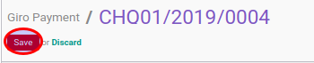

# Memodifikasi Giro payment

## A. INPUT

* Data giro payment yang akan dimodifikasi harus memiliki status **Draft**.

## B. LANGKAH KERJA

1. Buka menu **Accounting -> Bank & Cash -> Giro Payment**. Abaikan jika sudah berada pada menu yang dimaksud.
2. Buka data giro payment yang akan dimodifikasi. Abaikan jika data sudah dibuka.
3. Klik tombol **Edit** pada bagian atas-kiri form.

4. Ubah **[# Giro Payment](./penjelasan.md#field-name)** sesuai dengan nomor giro. Wajib diisi.
5. Ubah **[Company](./penjelasan.md#field-company)** jika dibutuhkan. Hanya terlihat pada implementasi multi-company. Harus diisi.
6. Isi dan sesuaikan **[Date](./penjelasan.md#field-date)**. Harus diisi.
7. Isi dan sesuaikan **[Date Issue](./penjelasan.md#field-date-issue)**. Harus diisi.
8. Isi dan sesuaikan **[Date Due](./penjelasan.md#field-date-due)**. Harus diisi.
9. Biarkan isian **[Period](./penjelasan.md#field-period)**.
10. Pilih dan sesuaikan **[Journal](./penjelasan.md#field-journal)**. Harus diisi.
11. Pilih dan sesuaikan **[Partner](./penjelasan.md#field-partner)** Harus diisi.
12. Pilih dan sesuaikan **[Source Bank Account](./penjelasan.md#field-source-account)**. Harus diisi.
13. Pilih dan sesuaikan **[Destination Bank Account](./penjelasan.md#field-destination-account)**. Harus diisi.
14. Isi dan sesuaikan **[Total Voucher](./penjelasan.md#field-total-voucher)**. Harus diisi.
15. Isi dan sesuaikan **[Exchange Rate](./penjelasan.md#field-exchange-rate)**. Harus diisi.
16. <a name="l16">[Import](./membuat-detail-import.md)/[Tambah](./membuat-detail-manual.md)/[Modifikasi](./line-modifikasi.md)/[Hapus](./line-hapus.md) **Voucher Lines**</a>. Ulangi langkah ini sampai **Voucher Lines** sesuai dengan keinginan.
17. <a name="langkah-17">Isi</a> **[Write-Off Account](./penjelasan.md#field-writeoff-account)** apabila nilai **[Amount Diff](./penjelasan.md#field-amount-diff)** tidak sama dengan 0.0 dan nominal tersebut ingin di-*write-off* ke akun tertentu.
18. Klik tombol **Save** pada bagian atas-kiri form.

## C. OUTPUT

* Data giro payment akan berubah sesuai dengan perubahan yang dilakukan.
