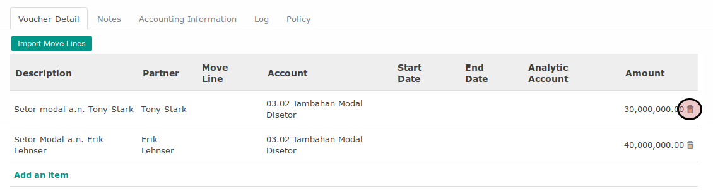

# Menghapus Voucher Line Pada Giro Receipt

*(Instruksi kerja ini merupakan sub instruksi dari (1) [Membuat Giro Receipt](./membuat.md), atau (2) [Memodifikasi Giro Receipt](./memodifikasi.md). Instruksi kerja ini tidak bisa berdiri sendiri)*

## A. INPUT

*(Tidak ada instruksi khusus)*

## B. LANGKAH KERJA

1. Klik icon tempat sampah pada bagian kanan data **Voucher Line** yang akan dihapus.

2. Lanjutkan prosedur (1) [Langkah ke-16 pada Membuat Giro Receipt](./membuat.md#langkah-16), atau (2) [Langkah ke-17 pada Memodifikasi Giro Receipt](./memodifikasi.md#langkah-17)

## C. OUTPUT

*(Tidak ada instruksi khusus)*
