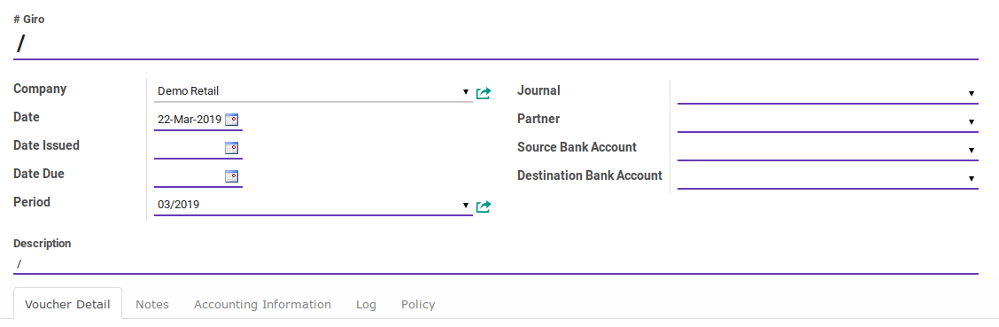
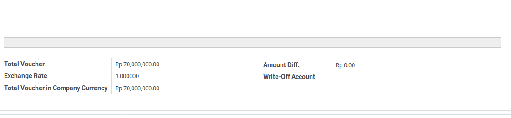

# Penjelasan

Informasi pada Giro Receipt dibagi menjadi beberapa area, diantaranya:

* [Header](#bagian-header)
* [Voucher Item](#bagian-detail)
* [Footer](#bagian-footer)
* [Tab Notes](#tab-notes)
* [Tab Accounting Information](#tab-accounting-information)
* [Tab Log](#tab-log)
* [Tab Policy](#tab-policy)

### <a name="bagian-header">HEADER</a>

#### <a name="field-name"># Giro Receipt</a>

Nomor giro yang diterima

#### <a name="field-company">Company</a>

Perusahaan pemilik dokumen giro receipt

#### <a name="field-ou">Default Operating Unit</a>

Operating unit pemilik dokumen. Secara default terisi sesuai dengan operating unit pada Journal.

#### <a name="field-date">Date</a>

Tanggal diterimanya giro

#### <a name="field-date-issue">Date Issue</a>

Tanggal dikeluarkannya giro

#### <a name="field-due">Date Due</a>

Tanggal giro dapat dicairkan

#### <a name="field-period">Period</a>

Periode akuntansi diterimanya giro

#### <a name="field-journal">Journal</a>

Buku jurnal yang akan digunakan untuk mencatat penjurnalan giro receipt.

#### <a name="field-partner">Partner</a>

Pihak yang mengeluarkan giro. Field ini akan menentukan *partner* yang digunakan pada penjurnalan
giro receipt. *Partner* yang digunakan pada penjurnalan giro receipt adalah *commercial partner*
dari isian **Partner**. Diisi apabila penerimaan terkait hanya dengan 1 pihak pemberi. Jangan diisi
apabila penerimaan terkait dengan lebih dari 1 pihak pemberi.

#### <a name="field-source-account">Source Bank Account</a>

Rekening bank yang mengeluarkan giro

#### <a name="field-destination-account">Destination Bank Account</a>

Rekening bank yang menerima dana

#### <a name="field-description">Description</a>

Keterangan utama transaksi. Isi field ini akan digunakan sebagai deskripsi penjurnalan giro receipt di
sisi debit. Akan muncul di *general ledger*

### <a name="bagian-footer">FOOTER</a>

#### <a name="field-total-voucher">Total Voucher</a>

Total penerimaan dalam mata uang yang sesuai dengan buku jurnal

#### <a name="field-exchange-rate">Exchange Rate</a>

Spot rate kurs

#### <a name="field-total-voucher-company-currency">Total Voucher In Company Currency</a>

Total penerimaan dalam mata uang perusahaan. Nilai ini akan didebit pada penjurnalan
giro receipt.

### <a name="bagian-detail">DETAIL</a>

#### <a name="field-detail-partner">Partner</a>

Pihak penerima. Apabila giro receipt terkait hanya dengan satu pihak penerima, maka isian
ini harus sama dengan isian **Partner** pada bagian header.

#### <a name="field-detail-move-line">Move Line</a>

Journal item yang akan direkonsiliasi

#### <a name="field-detail-account">Account</a>

Akun yang akan dikredit pada penjurnalan giro receipt

#### <a name="field-detail-aa">Analytic Account</a>

Kode biaya

#### <a name="field-detail-amount">Amount</a>

Jumlah detail penerimaan.

#### <a name="field-detail-amount-move-date">Amount In Company Currency At Move Date</a>

Jumlah detail penerimaan sesuai dengan mata uang perusahaan dengan kurs tanggal **Move Line**

#### <a name="field-detail-amount-voucher-date">Amount In Company Currency At Voucher Date</a>

Jumlah detail penerimaan sesuai dengan mata uang perusahaan dengan kurs sesuai dengan spot rate. Nilai ini akan dikredit pada penjurnalan giro receipt jika bernilai positif. Nilai ini akan didebit jika bernilai negatif.

#### <a name="field-detail-diff">Diff Amount In Company Currency</a>

Selisih antara **Amount In Company Currency At Move Date** dan **Amount In Company Currency At Voucher Date**. Nilai ini akan dijurnal sebagai selisih kurs jika > 0.0

#### <a name="field-detail-description">Description</a>

Keterangan **Voucher Detail**.

### <a name="tab-notes">TAB NOTES</a>

#### <a name="field-note">Note</a>

Catatan tambahan

### <a name="tab-accounting-information">TAB ACCOUNTING INFORMATION</a>

#### <a name="field-accounting-entry">Accounting Entry</a>

Penjurnalan (journal entry) yang dihasilkan ketika giro receipt diposting

### <a name="tab-log">TAB LOG</a>

### <a name="tab-log">TAB POLICY</a>

