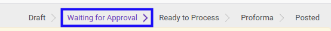
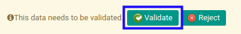
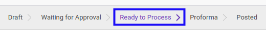

# Menyetujui Invoice Settlement

## A. INPUT

* Data *invoice settlement* yang akan disetujui harus memiliki status **Waiting for Approval**.

* User yang akan menyetujui harus memiliki akses untuk menyetujui *invoice settlement*.

## B. LANGKAH KERJA

1. Buka menu **Accounting -> Settlement -> invoice Settlement**. Abaikan jika sudah berada pada menu yang dimaksud.
2. Buka data *invoice settlement* yang akan disetujui. Abaikan jika data sudah dibuka.
3. Klik tombol **Validate** pada bagian atas-kiri form.

## C. OUTPUT

* Status dari *invoice settlement* akan berubah menjadi **Ready To Process**

