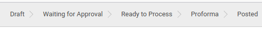
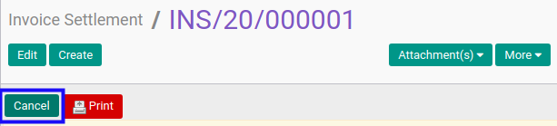
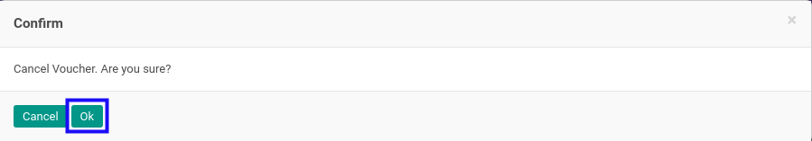
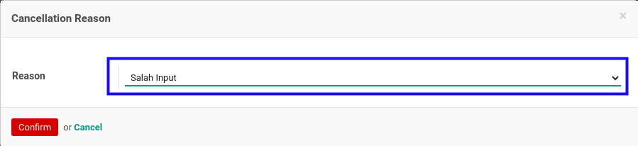
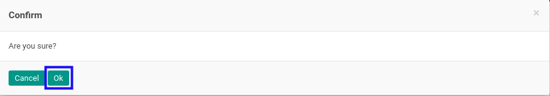
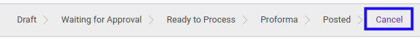

# Membatalkan Invoice Settlement

## A. INPUT

* Data *invoice settlement* yang akan dibatalkan dapat memiliki status **Draft**, atau **Waiting for Approval**, atau **Ready To Process**, atau **Proforma**, atau **Posted**

* User yang akan membatalkan harus memiliki akses untuk membatalkan *invoice settlement*.

## B. LANGKAH KERJA

1. Buka menu **Accounting -> Settlement -> Invoice Settlement**. Abaikan jika sudah berada pada menu yang dimaksud.
2. Buka data *invoice settlement* yang akan dibatalkan. Abaikan jika data sudah dibuka.
3. Klik tombol **Cancel** pada bagian atas-kiri form.

4. Klik tombol **Ok** pada *pop-up* konfirmasi pembatalan yang muncul.

5. Pilih **Reason** pada *pop-up* **Cancellation Reason** yang muncul.

6. Klik tombol **Confirm** pada *pop-up* Cancellation Reason.

7. Klik tombol **Ok** pada *pop-up* konfirmasi pembatalan yang muncul.

## C. OUTPUT

* Status dari *invoice settlement* akan berubah menjadi **Cancel**

* Penjurnalan yang dihasilkan akan dihapus.
