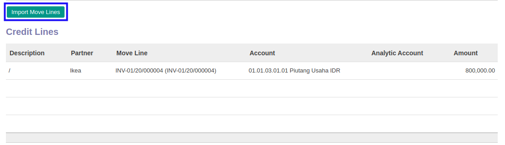
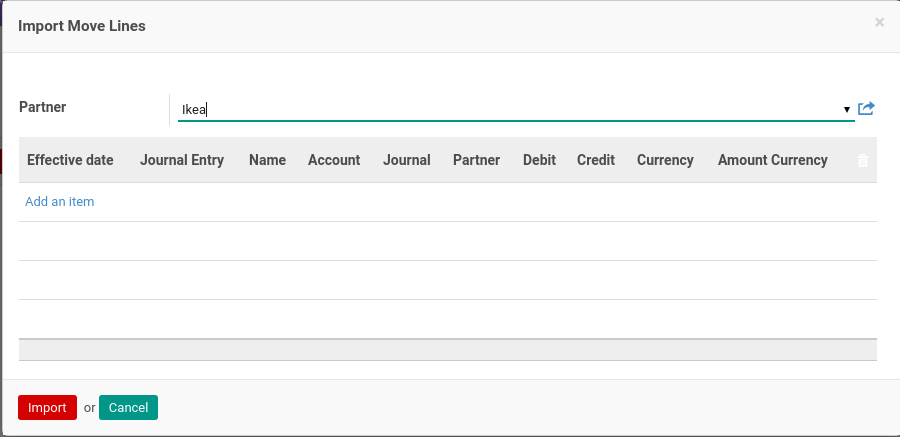
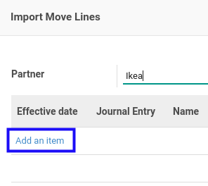

# Import Credit Line

*(Instruksi kerja ini merupakan sub instruksi dari (1) [Membuat Invoice Settlement](./membuat.md), atau (2) [Memodifikasi Invoice Settlement](./memodifikasi.md). Instruksi kerja ini tidak bisa berdiri sendiri)*

## A. INPUT

*(Tidak ada instruksi khusus)*

## B. LANGKAH KERJA

1. Klik tombol **Import Move Line** pada bagian **[Credit Lines](./penjelasan.md#bagian-credit-line)**.

Pop-up **Import Move Line** akan muncul.

2. Klik label **Add an Item**.

3. Pilih *journal item*.
4. Klik tombol **Import** pada bagian bawah-kiri pop-up.

5. Lakukan sampai semua *journal item* yang mau direkonsiliasi sudah terimport.
6. Lanjutkan prosedur (1) [Langkah ke-11 pada Membuat Invoice Settlement](./membuat.md#langkah-11), atau (2) [Langkah ke-12 pada Memodifikasi Invoice Settlement](./memodifikasi.md#langkah-12).

## C. OUTPUT

*(Tidak ada instruksi khusus)*
