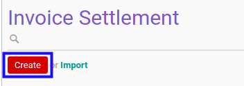

# Membuat Invoice Settlement

## A. INPUT

*(Tidak ada instruksi khusus)*

## B. LANGKAH KERJA

1. Buka menu **Accounting -> Settlement -> Invoice Settlement**
2. Klik tombol **Create** pada bagian atas-kiri form.

3. Ubah **[# Invoice Settlement](./penjelasan.md#field-name)** dengan penomeran yang dikehendaki. Biarkan berisi **/** apabila menghendaki penomeran otomatis.
4. Ubah **[Company](./penjelasan.md#field-company)** jika dibutuhkan. Hanya terlihat pada implementasi multi-company. Wajib diisi.
5. Pilih **[Date](./penjelasan.md#field-date)**. Wajib diisi.
6. Biarkan isian **[Period](./penjelasan.md#field-period)**.
7. Pilih **[Journal](./penjelasan.md#field-journal)**. Wajib diisi.
8. Pilih **[Partner](./penjelasan.md#field-partner)** Tidak wajib diisi.
9. Isi **[Exchange Rate](./penjelasan.md#field-exchange-rate)**. Wajib diisi.
10. <a name="langkah-10">Untuk</a> setiap *supplier invoice* yang akan di-*settle*, [import](./import-debit-line.md)/[modifikasi](./memodifikasi-debit-line.md)/[hapus](./menghapus-debit-line.md) debit lines. Ulangi langkah ini sampai **Debit Lines** sesuai dengan keinginan.
11. <a name="langkah-11">Untuk</a> setiap *customer invoice* yang akan di-*settle*, [import](./import-credit-line.md)/[modifikasi](./memodifikasi-credit-line.md)/[hapus](./menghapus-credit-line.md) credit lines. Ulangi langkah ini sampai **Credit Lines** sesuai dengan keinginan.
12. <a name="langkah-12">Klik</a> tombol **Save** pada bagian atas-kiri form.

## C. OUTPUT

*(Tidak ada instruksi khusus)*
