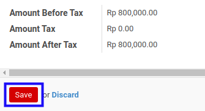

# Memodifikasi Credit Line

*(Instruksi kerja ini merupakan sub instruksi dari (1) [Membuat Invoice Settlement](./membuat.md), atau (2) [Memodifikasi Invoice Settlement](./memodifikasi.md). Instruksi kerja ini tidak bisa berdiri sendiri)*

## A. INPUT

*(Tidak ada instruksi khusus)*

## B. LANGKAH KERJA

1. Buka data **Credit Line** yang akan dimodifikasi.
2. Pilih dan sesuaikan **[Analytic Account](./penjelasan.md#field-credit-line-aa)** jika dibutuhkan. Tidak wajib diisi.
3. Isi dan sesuaikan **[Amount](./penjelasan.md#field-credit-line-amount)** jika dibutuhkan. Wajib diisi.
4. Isi dan sesuaikan **[Description](./penjelasan.md#field-credit-line-description)** jika dibutuhkan. Wajib diisi.
5. Apabila ada pajak yang muncul terkait dengan credit line, maka lakukan langkah
penginputan credit line tax.
6. Klik tombol **Save** pada bagian bawah-kiri form.

7. Lanjutkan prosedur (1) [Langkah ke-11 pada Membuat Invoice Settlement](./membuat.md#langkah-11), atau (2) [Langkah ke-12 pada Memodifikasi Invoice Settlement](./memodifikasi.md#langkah-12).

## C. OUTPUT

*(Tidak ada instruksi khusus)*
