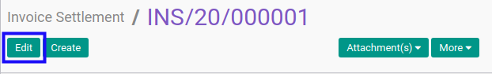
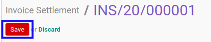

# Memodifikasi Invoice Settlement

## A. INPUT

* Data invoice settlement yang akan dimodifikasi harus memiliki status **Draft**.

## B. LANGKAH KERJA

1. Buka menu **Accounting -> Settlement -> Invoice Settlement**. Abaikan jika sudah berada pada menu yang dimaksud.
2. Buka data invoice settlement yang akan dimodifikasi. Abaikan jika data sudah dibuka.
3. Klik tombol **Edit** pada bagian atas-kiri form.

4. Ubah **[# Invoice Settlement](./penjelasan.md#field-name)** jika dibutuhkan. Wajib diisi.
5. Ubah dan sesuaikan **[Company](./penjelasan.md#field-company)** jika dibutuhkan. Hanya terlihat pada implementasi multi-company. Wajib diisi.
6. Pilih dan sesuaikan **[Date](./penjelasan.md#field-date)** jika dibutuhkan. Wajib diisi.
7. Biarkan isian **[Period](./penjelasan.md#field-period)**.
8. Pilih dan sesuaikan **[Journal](./penjelasan.md#field-journal)** jika dibutuhkan. Wajib diisi.
9. Pilih dan sesuaikan **[Partner](./penjelasan.md#field-partner)** jika dibutuhkan. Tidak wajib diisi.
10. Isi dan sesuaikan **[Exchange Rate](./penjelasan.md#field-exchange-rate)**. Wajib diisi.
11. <a name="langkah-11">Untuk</a> setiap *supplier invoice* yang akan di-*settle*, [import](./import-debit-line.md)/[modifikasi](./memodifikasi-debit-line.md)/[hapus](./menghapus-debit-line.md) debit lines. Ulangi langkah ini sampai **Debit Lines** sesuai dengan keinginan.
12. <a name="langkah-12">Untuk</a> setiap *customer invoice* yang akan di-*settle*, [import](./import-credit-line.md)/[modifikasi](./memodifikasi-credit-line.md)/[hapus](./menghapus-credit-line.md) credit lines. Ulangi langkah ini sampai **Credit Lines** sesuai dengan keinginan.
13. <a name="langkah-13">Klik</a> tombol **Save** pada bagian atas-kiri form.

## C. OUTPUT

* Data invoice settlement akan berubah sesuai dengan perubahan yang dilakukan.
