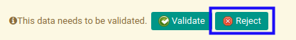

# Menolak Invoice Settlement

## A. INPUT

* Invoice settlement yang dapat ditolak harus memiliki status **Waiting for Approval**.

* User yang akan menolak harus memiliki akses untuk menolak invoice settlement.

## B. LANGKAH KERJA

1. Buka menu **Accounting -> Settlement -> Invoice Settlement**. Abaikan jika sudah berada pada menu yang dimaksud.
2. Buka data invoice settlement yang akan ditolak. Abaikan jika data sudah dibuka.
3. Klik tombol **Reject** pada bagian atas-kiri form.

## C. OUTPUT

* Data invoice settlement telah ditolak.

