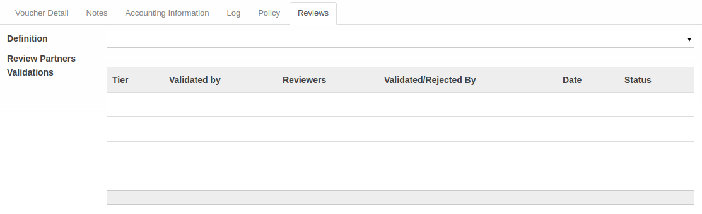

# Penjelasan

Informasi pada *Invoice Settlement* dibagi menjadi beberapa area, diantaranya:

* [Header](#bagian-header)
* [Debit Lines](#bagian-debit-line)
* [Credit Lines](#bagian-credit-line)
* [Footer](#bagian-footer)
* [Tab Notes](#tab-notes)
* [Tab Accounting Information](#tab-accounting-information)
* [Tab Log](#tab-log)
* [Tab Policy](#tab-policy)
* [Tab Reviews](#tab-reviews)

### <a name="bagian-header">HEADER</a>

#### <a name="field-name"># Invoice Settlement</a>

Nomor dokumen *invoice settlement*.

#### <a name="field-company">Company</a>

Perusahaan pemilik dokumen *invoice settlement*

#### <a name="field-date">Date</a>

Tanggal transaksi.

#### <a name="field-period">Period</a>

Periode akuntansi terjadinya transaksi.

#### <a name="field-journal">Journal</a>

Buku jurnal yang akan digunakan untuk mencatat penjurnalan *invoice settlement*.

#### <a name="field-partner">Partner</a>

Pihak yang memberikan *customer invoice*. Field ini akan menentukan *partner* yang digunakan pada penjurnalan *invoice settlement*. *Partner* yang digunakan pada penjurnalan *invoice settlement* adalah *commercial partner* dari isian **Partner**. Diisi apabila *settlement* terkait hanya dengan 1 pihak pemberi. Jangan diisi apabila *settlement* terkait dengan lebih dari 1 pihak pemberi.

#### <a name="field-description">Description</a>

Keterangan utama transaksi.

### <a name="bagian-footer">FOOTER</a>

#### <a name="field-debit">Debit</a>

*to do*

#### <a name="field-credit">Credit</a>

*to do*

#### <a name="field-exchange-rate">Exchange Rate</a>

Spot rate kurs.

#### <a name="field-amount-diff">Amount Diff.</a>

*to do*

#### <a name="field-write-off-account">Write-Off Account</a>

*to do*

### <a name="bagian-debit-line">DEBIT LINES</a>

Tampilan tree:

Tampilan form:

#### <a name="field-debit-line-partner">Partner</a>

Pihak yang mempunyai piutang dagang. Apabila *invoice settlement* terkait hanya dengan satu pihak, maka isian ini harus sama dengan isian **Partner** pada bagian header.

#### <a name="field-debit-line-move-line">Move Line</a>

Journal item *customer invoice* yang akan direkonsiliasi.

#### <a name="field-debit-line-account">Account</a>

Akun yang akan didebit pada penjurnalan *invoice settlement*

#### <a name="field-debit-line-aa">Analytic Account</a>

Kode biaya.

#### <a name="field-debit-line-amount">Amount</a>

Jumlah *customer invoice* yang akan di-*settle*.

#### <a name="field-debit-line-amount-move-date">Amount In Company Currency At Move Date</a>

Jumlah detail *customer invoice* yang akan di-*settle* sesuai dengan mata uang perusahaan dengan kurs tanggal **Move Line**

#### <a name="field-debit-line-amount-voucher-date">Amount In Company Currency At Voucher Date</a>

Jumlah *customer invoice* yang akan di-*settle* sesuai dengan mata uang perusahaan dengan kurs sesuai dengan spot rate. Nilai ini akan didebit pada penjurnalan *invoice settlement* jika bernilai positif. Nilai ini akan dikredit jika bernilai negatif.

#### <a name="field-debit-line-diff">Diff Amount In Company Currency</a>

Selisih antara **Amount In Company Currency At Move Date** dan **Amount In Company Currency At Voucher Date**. Nilai ini akan dijurnal sebagai selisih kurs jika > 0.0

#### <a name="field-debit-line-description">Description</a>

Keterangan **Debit Lines**.

### <a name="bagian-credit-line">CREDIT LINES</a>

Tampilan tree:

Tampilan form:

#### <a name="field-credit-line-partner">Partner</a>

Pihak yang memberikan *Customer Invoice*. Apabila isian **Partner** pada bagian header diisi, maka isian ini harus sama dengan isian **Partner** pada bagian header.

#### <a name="field-credit-line-move-line">Move Line</a>

Journal item *customer invoice* yang akan direkonsiliasi.

#### <a name="field-credit-line-account">Account</a>

Akun yang akan dikredit pada penjurnalan *invoice settlement*.

#### <a name="field-credit-line-aa">Analytic Account</a>

Kode biaya.

#### <a name="field-credit-line-amount">Amount</a>

Jumlah *customer invoice* yang akan di-*settle*.

#### <a name="field-credit-line-amount-move-date">Amount In Company Currency At Move Date</a>

Jumlah *customer invoice* yang akan di-*settle* sesuai dengan mata uang perusahaan dengan kurs tanggal **Move Line**

#### <a name="field-credit-line-amount-voucher-date">Amount In Company Currency At Voucher Date</a>

Jumlah *customer invoice* yang akan di-*settle* sesuai dengan mata uang perusahaan dengan kurs sesuai dengan spot rate. Nilai ini akan dikredit pada penjurnalan *invoice settlement* jika bernilai positif. Nilai ini akan didebit jika bernilai negatif.

#### <a name="field-credit-line-diff">Diff Amount In Company Currency</a>

Selisih antara **Amount In Company Currency At Move Date** dan **Amount In Company Currency At Voucher Date**. Nilai ini akan dijurnal sebagai selisih kurs jika > 0.0

#### <a name="field-credit-line-description">Description</a>

Keterangan **Credit Lines**.

### <a name="tab-notes">TAB NOTES</a>

#### <a name="field-note">Note</a>

Catatan tambahan.

### <a name="tab-accounting-information">TAB ACCOUNTING INFORMATION</a>

#### <a name="field-accounting-entry">Accounting Entry</a>

Penjurnalan (journal entry) yang dihasilkan ketika *invoice settlement* diposting

### <a name="tab-log">TAB LOG</a>

#### <a name="field-confirmation">Confirmation</a>

Log aktifitas User yang melakukan konfirmasi.

#### <a name="field-approval">Approval</a>

Log aktifitas User yang melakukan persetujuan.

#### <a name="field-proforma">Proforma</a>

Log aktifitas User yang melakukan proforma.

#### <a name="field-post">Post</a>

Log aktifitas User yang melakukan posting.

#### <a name="field-cancellation">Cancellation</a>

Log aktifitas User yang melakukan pembatalan.

### <a name="tab-policy">TAB POLICY</a>

#### <a name="field-can-confirm">Can Confirm</a>

Kebijakan untuk dapat melakukan konfirmasi.

#### <a name="field-can-proforma">Can Proforma</a>

Kebijakan untuk dapat melakukan proforma.

#### <a name="field-can-post">Can Post</a>

Kebijakan untuk dapat melakukan posting.

#### <a name="field-can-cancel">Can Cancel</a>

Kebijakan untuk dapat melakukan pembatalan.

#### <a name="field-can-restart">Can Restart</a>

Kebijakan untuk dapat melakukan restart.

#### <a name="field-can-restart-validation">Can Restart Validation</a>

Kebijakan untuk dapat melakukan validasi restart.

### <a name="tab-reviews">TAB REVIEWS</a>

#### <a name="field-definition">Definition</a>

Definisi review yang digunakan.

#### <a name="field-review-partners-validations">Review Partners Validations</a>

Daftar partner yang melakukan validasi.
