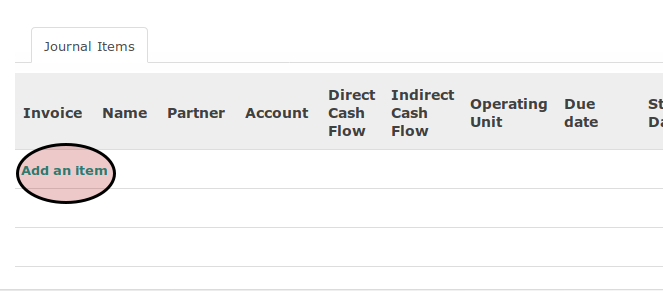

# Journal Item

1. <a name="l1">Klik</a> tombol **Add an Item** pada tabel **Journal Items**.

2. Isi **[Name](./penjelasan.md#field-name)**. Harus diisi.
3. Pilih **[Partner](./penjelasan.md#field-partner)**. Tidak harus diisi.
4. Pilih **[Account](./penjelasan.md#field-account)**. Harus diisi.
5. Pilih **[Direct Cash Flow](./penjelasan.md#field-direct-cash-flow)**. Tidak harus diisi.
6. Pilih **[Indirect Cash Flow](./penjelasan.md#field-indirect-cash-flow)**. Tidak harus diisi.
7. Abaikan **[Operating Unit](./penjelasan.md#field-ou)**. Tidak harus diisi.
8. Isi **[Due Date](./penjelasan.md#field-ou)**. Tidak harus diisi.
9. Isi **[Start Date](./penjelasan.md#field-start-date)**. Tidak harus diisi.
10. Isi **[End Date](./penjelasan.md#field-end-date)**. Tidak harus diisi.
11. Isi **[Debit](./penjelasan.md#field-debit)**. Harus diisi.
12. Isi **[Credit](./penjelasan.md#field-credit)**. Harus diisi.
13. Pilih **[Analytic Account](./penjelasan.md#field-aa)**. Tidak harus diisi.
14. Isi **[Amount Currency](./penjelasan.md#field-amount-currency)**. Tidak harus diisi.
15. Pilih **[Currency](./penjelasan.md#field-currency)**. Tidak harus diisi.
16. Pilih **[Tax Account](./penjelasan.md#field-tax-account)**. Tidak harus diisi.
17. Isi **[Tax/Base Amount](./penjelasan.md#field-tax-amount)**. Tidak harus diisi.
18. Pilih **[Asset Category](./penjelasan.md#field-asset-category)**. Tidak harus diisi.
19. Abaikan **Asset**
20. Ulang kembali [langkah ke-1](#l1) untuk menambahkan *journal item* lainnya.
21. Lanjutkan ke [prosedur pembuatan *journal entry* langkah ke-11](./membuat.md#l11)
