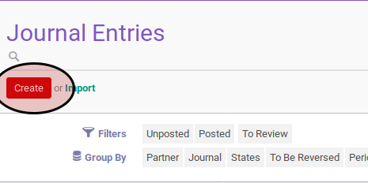
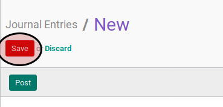

# Membuat Journal Entry

## A. INPUT

## B. LANGKAH KERJA

1. Buka menu **Accounting -> Journal Entry -> Journal Entry**.
2. Klik tombol **Create** pada bagian atas-kiri form.

3. Pilih **[Journal](./penjelasan.md#field-journal)**. Harus diisi.
4. Sesuaikan **[Operating Unit](./penjelasan.md#field-ou)** jika dibutuhkan. Tidak harus diisi.
5. Pilih **[Period](./penjelasan.md#field-period)**. Harus diisi.
6. Aktifkan **[To Be Reversed](./penjelasan.md#field-2breverse)** jika dibutuhkan.
7. Isi **[Reference](./penjelasan.md#field-reference)**. Tidak harus diisi.
8. Isi **[Date](./penjelasan.md#field-date)**. Harus diisi.
9. Aktifkan **[To Review](./penjelasan.md#field-2review)** jika dibutuhkan.
10. Untuk setiap item penjurnalan lakukan [prosedur penginputan journal item](./membuat-item.md).
11. <a name="l11">Isi</a> **[Additional Information](./penjelasan.md#field-additional-information)**. Tidak harus diisi.
12. Klik tombol **Save** pada bagian atas-kiri form.

## C. OUTPUT

* *Journal entry* akan terbuat dengan status **Unposted**

