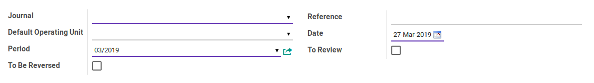
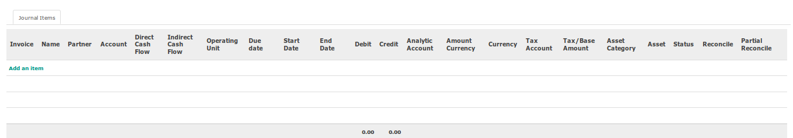

# Penjelasan

Informasi pada *journal entry* dibagi menjadi beberapa 2 (dua) bagian, yaitu:

* [Header](#bagian-header)
* [Journal Item](#bagian-detail)

### <a name="bagian-header">HEADER</a>

#### <a name="field-journal">Journal</a>

Buku jurnal yang digunakan untuk mencatat penjurnalan

#### <a name="field-ou">Default Operating Unit</a>

#TODO

#### <a name="field-period">Period</a>

Periode akuntansi dimana terjadinya penjurnalan

#### <a name="field-2breverse">To Be Reverse</a>

Apabila aktif maka penjurnalan harus dibalikkan.

#### <a name="field-reference">Reference</a>

Nomor dokumen sumber penjurnalan

#### <a name="field-date">Date</a>

Tanggal terjadinya penjurnalan

#### <a name="field-2review">To Review</a>

Apabila aktif maka penjurnalan masih butuh dicek sebelum diposting

### <a name="bagian-detail">JOURNAL ITEM</a>

#### <a name="field-invoice">Invoice</a>

#TODO

#### <a name="field-name">Name</a>

Deskripsi dari journal item. Deskripsi ini akan muncul pada *general ledger*

#### <a name="field-partner">Partner</a>

Pihak yang terkait dengan *journal item*

#### <a name="field-account">Account</a>

Kode akun yang digunakan

#### <a name="field-direct">Direct Cash Flow Code</a>

Kategorisasi *direct cash flow*. Kategori ini akan menentukan di bagian mana *journal item* ini akan diperhitungkan pada laporan *direct cash flow*

#### <a name="field-indirect">Indirect Cash Flow Code</a>

Kategorisasi *direct cash flow*. Kategori ini akan menentukan di bagian mana *journal item* ini akan diperhitungkan pada laporan *indirect cash flow*

#### <a name="field-ou">Operating Unit</a>

#TODO

#### <a name="field-due-date">Due Date</a>

Tanggal jatuh tempo (jika ada) dimana *journal item* harusnya direkonsiliasi

#### <a name="field-start-date">Start Date</a>

#TODO

#### <a name="field-end-date">End Date</a>

#TODO

#### <a name="field-debit">Debit</a>

Nilai yang didebit. Nilai debit tidak boleh bernilai negatif.

#### <a name="field-credit">Credit</a>

Nilai yang dikredit. Nilai kredit tidak boleh bernilai negetif.

#### <a name="field-aa">Analytic Account</a>

Kode biaya.

#### <a name="field-amount-currency">Amount Currency</a>

Nilai *journal item* dalam mata uang asing. Hanya diisi apabila *journal entry* merupakan penjurnalan *multi-currency*. Nilai *amount currency* bernilai positif apabila nilai **Debit** bernilai > 0.0. Nilai *amount currency* bernilai negatif apabila nilai **Credit** bernilai < 0.0.

#### <a name="field-currency">Currency</a>

Mata uang penjurnalan. Hanya diisi apabila *journal entry* merupakan penjurnalan *multi-currency*.

#### <a name="field-tax-account">Tax Account</a>

#TODO

#### <a name="field-tax-amount">Tax/Base Amount</a>

#TODO

#### <a name="field-asset-category">Asset Category</a>

#TODO

#### <a name="field-asset">Asset</a>

#TODO

#### <a name="field-status">Status</a>

#TODO

#### <a name="field-reconcile">Reconcile</a>

#TODO

#### <a name="field-partial-reconcile">Partial Reconcile</a>

#TODO
