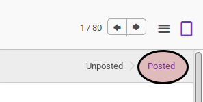
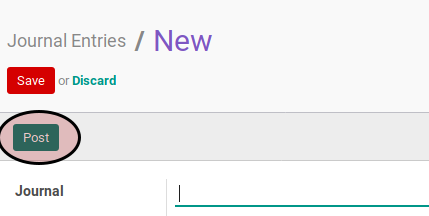
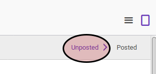

# Membatalkan Postingan Journal Entry

## A. INPUT

* Data *journal entry* yang akan dibatalkan postingannya harus memiliki status **Posted**

## B. LANGKAH KERJA

1. Buka menu **Accounting -> Journal Entry -> Journal Entry**. Abaikan jika sudah berada pada menu tersebut.
2. Buka data *journal entry* yang akan dibatalkan postingannya. Abaikan jika data *journal entry* yang akan dibatalkan postingannya sudah dibuka.
3. Klik tombol **Post** pada bagian atas-kiri form.

## C. OUTPUT

* Status dari *journal entry* akan berubah menjadi **Unposted**

