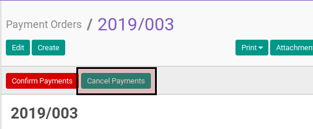

# Membatalkan Payment Order

## A. INPUT

* Data payment order yang akan dibatalkan harus memiliki status **Confirmed**.

* User yang akan membatalkan harus memiliki akses untuk membatalkan payment order.

## B. LANGKAH KERJA

1. Buka menu **Accounting -> Payment -> Payment Orders**. Abaikan jika sudah berada
pada menu yang dimaksud.
2. Buka data payment order yang akan dibatalkan. Abaikan jika data sudah dibuka.
3. Klik tombol **Cancel Payments** pada bagian atas-kiri form.

## C. OUTPUT

* Status dari payment order akan berubah menjadi **Cancelled**

