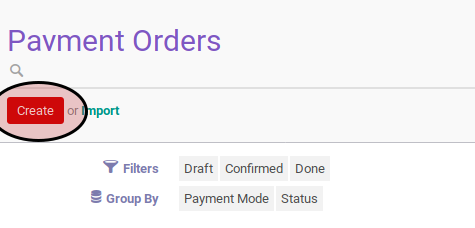
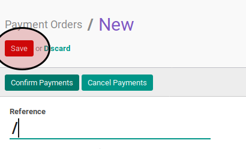

# Membuat Payment Order

## A. INPUT

*(Tidak ada instruksi khusus)*

## B. LANGKAH KERJA

1. Buka menu **Accounting -> Payment -> Payment Orders**. Abaikan jika sudah berada pada menu yang dimaksud.
2. Klik tombol **Create** pada bagian atas-kiri form.

3. Isi dan sesuaikan **Reference** jika dibutuhkan. Harus diisi.
4. Pilih **Responsible**. Harus diisi.
5. Pilih **Payment Mode**. Harus diisi.
6. Pilih **Preferred Date**. Lanjutkan ke langkah ke-8 jika pilihan **Preferred Date** tidak sama dengan **Fixed Date**.
7. Isi **Scheduled Date**. Harus diisi.
8. Import/Tambah/Modifikasi/Hapus **Payment Order Lines**. Ulangi langkah ini sampai **Payment Order Lines** sesuai dengan keinginan.
9. Klik tombol **Save** pada bagian atas-kiri form.

## C. OUTPUT

* Data payment order akan terbuat dengan status **Draft**

