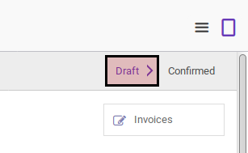

# Memodifikasi Payment Order

## A. INPUT

* Payment order yang dapat dimodifikasi harus memiliki status **Draft**

## B. LANGKAH KERJA

1. Buka menu **Accounting -> Payment -> Payment Orders**. Abaikan jika sudah berada pada menu yang dimaksud.
2. Buka data payment order yang akan dimodifikasi. Abaikan jika data sudah dibuka.
3. Klik tombol **Edit** pada bagian atas-kiri form.

4. Isi dan sesuaikan **Reference** jika dibutuhkan. Harus diisi.
5. Pilih dan sesuaikan **Responsible** jika dibutuhkan. Harus diisi.
6. Pilih dan sesuaikan **Payment Mode** jika dibutuhkan. Harus diisi.
7. Pilih dan sesuaikan **Preferred Date** jika dibutuhkan. Lanjutkan ke langkah ke-9 jika pilihan **Preferred Date** tidak sama dengan **Fixed Date**.
8. Isi dan sesuaikan **Scheduled Date** jika dibutuhkan. Harus diisi.
9. Import/Tambah/Modifikasi/Hapus **Payment Order Lines**. Ulangi langkah ini sampai **Payment Order Lines** sesuai dengan keinginan.
10. Klik tombol **Save** pada bagian atas-kiri form.

## C. OUTPUT

* Data payment order akan berubah sesuai dengan perubahan yang dilakukan.
