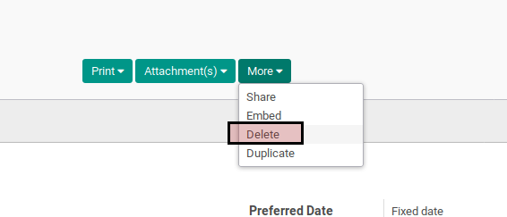
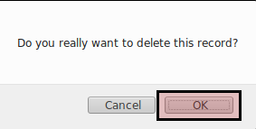

# Menghapus Payment Order

## A. INPUT

* Payment order yang dapat dihapus harus memiliki status **Draft**

## B. LANGKAH KERJA

1. Buka menu **Accounting -> Payment -> Payment Orders**. Abaikan jika sudah berada pada menu yang dimaksud.
2. Buka data payment order yang akan dihapus. Abaikan jika data sudah dibuka.
3. Klik tombol **More** pada bagian atas-kiri form.

4. Klik tombol **Delete** pada drop-down yang muncul pada tombol **More**.

5. Klik tombol **Ok** pada dialog konfirmasi penghapusan yang muncul.

## C. OUTPUT

* Data payment order akan terhapus.
