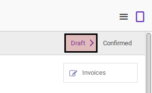
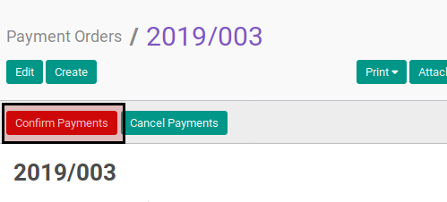
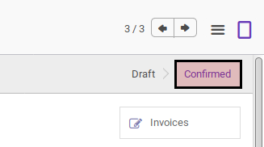

# Mengkonfirmasi Payment Order

## A. INPUT

* Data payment order yang akan dikonfirmasi harus memiliki status **Draft**.

* User yang akan mengkonfirmasi harus memiliki akses untuk mengkonfirmasi payment order.

## B. LANGKAH KERJA

1. Buka menu **Accounting -> Payment -> Payment Orders**. Abaikan jika sudah berada
pada menu yang dimaksud.
2. Buka data payment order yang akan dikonfirmasi. Abaikan jika data sudah dibuka.
3. Klik tombol **Confirm** pada bagian atas-kiri form.

## C. OUTPUT

* Status dari payment order akan berubah menjadi **Confirmed**

* Isian payment order sudah tidak bisa diubah
