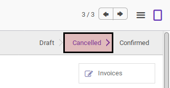
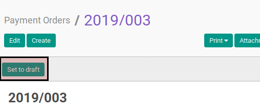

# Merestart Payment Order

## A. INPUT

* Data payment order yang akan direstart harus memiliki status **Cancelled**.

* User yang akan merestart harus memiliki akses untuk merestart payment order.

## B. LANGKAH KERJA

1. Buka menu **Accounting -> Payment -> Payment Orders**. Abaikan jika sudah berada
pada menu yang dimaksud.
2. Buka data payment order yang akan direstart. Abaikan jika data sudah dibuka.
3. Klik tombol **Set To Draft** pada bagian atas-kiri form.

## C. OUTPUT

* Status dari payment order akan berubah menjadi **Draft**

* Payment order dapat kembali dimodifikasi
