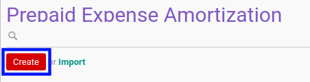

# Membuat Prepaid Expense Amortization

## A. INPUT

*(Tidak ada instruksi khusus)*

## B. LANGKAH KERJA

1. Buka menu **Accounting -> Amortization -> Prepaid Expenses**. Abaikan jika sudah berada pada menu yang dimaksud.
2. Klik tombol **Create** pada bagian atas-kiri form.

3. Ubah **[# Document](./penjelasan.md#field-#document)** dengan penomeran yang dikehendaki. Biarkan berisi **/**
apabila menghendaki penomeran otomatis. Wajib diisi.
4. Pilih **[Move Line](./penjelasan.md#field-move-line)**. Wajib diisi.
5. Pilih dan sesuaikan **[Journal](./penjelasan.md#field-journal)** jika dibutuhkan. Wajib diisi.
6. Pilih **[Amortization Contra Account](./penjelasan.md#field-amortization-contra-account)**. Wajib diisi.
7. Pilih **[Analytic Account](./penjelasan.md#field-analytic-account)**. Tidak wajib diisi.
8. Beralih ke tab **[Amortization Schedule](./penjelasan.md#tab-amortization-schedule)**.
9. Pilih tanggal **[Start Amortization](./penjelasan.md#field-start-amortization)**. Wajib diisi.
10. Pilih **[Period](./penjelasan.md#field-period)**. Wajib diisi.
11. Isi **[Period Number](./penjelasan.md#field-period-number)**. Wajib diisi.
12. Klik tombol **Save** pada bagian atas-kiri form.

## C. OUTPUT

* Data prepaid expense amortization akan terbuat dengan status **Draft**

